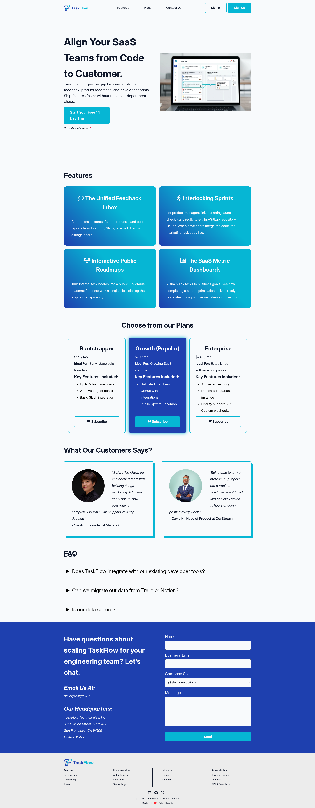
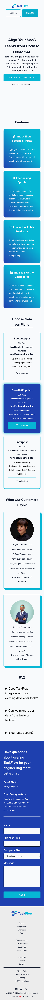

# TaskFlow

TaskFlow is a mockup (responsive) landing website for SaaS Productivity Tool.

## Sections
- <strong>Hero Section</strong> - This section showcase the what TaskFlow offers.
- <strong>Features</strong> - A section showcasing all the services.
- <strong>Pricing & Testimonials</strong> - Price of the service and feedback of customers.
- <strong>Contact Us</strong> - This ensures that potential customers can reach out.
- <strong>FAQs</strong> - For most common questions regarding the services.

## Demo
Live Demo: <a href="https://taskflowprodapp.netlify.app/" target="_blank">taskflowprodapp.netlify.app</a>
| Desktop View | Mobile View |
| ------------ | ----------- |
|  |  |

## Getting Started

If you are interested in cloning this mockup website, feel free to do so.

```
git clone https://github.com/bray-hiramis/taskflow.git
cd taskflow
```

## What have I learned?

During the process of building this project, I learned:
- How to properly align the content of the website.
- How to keep the navigation bar to be fixed at the top of the website.
- How to use SASS (css pre-compiler) and utilize its modular feature to separate the main stylesheet to the variables (css variables).

## Tech Stack
- HTML
- SASS (CSS pre-compiler)

### Special Mention Tools:
- <strong>Gemini AI</strong> for helping me brainstorming the content for the website, and the fonts and colors to use.
- <strong>Gimp</strong> for photo editing
- <strong>Inkscape</strong> for the logo design (The logo used for this website is generated by Gemini AI and re-trace in Inkscape).

> [!NOTE]
> All HTML and CSS are written manually and no AI prompts were used to generate codes.

## Author
<strong>&ndash; Brian Hiramis</strong>