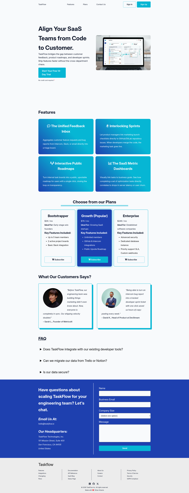

# TaskFlow

TaskFlow is a mockup (responsive) landing website for SaaS Productivity Tool.

## Sections
- <strong>Hero Section</strong> - This section showcase the what TaskFlow offers.
- <strong>Features</strong> - A section showcasing all the services.
- <strong>Pricing & Testimonials</strong> - Price of the service and feedback of customers.
- <strong>Contact Us</strong> - This ensures that potential customers can reach out.
- <strong>FAQs</strong> - For most common questions regarding the services.

## Demo
Live Demo: <a href="https://taskflowprodapp.netlify.app/" target="_blank">taskflowprodapp.netlify.app</a>
| Desktop View | Mobile View |
| ------------ | ----------- |
|  | ----------- |

## Getting Started

If you are interested in cloning this mockup website, feel free to do so.

```
git clone https://github.com/bray-hiramis/taskflow.git
cd taskflow
```

## Tech Stack
- HTML
- SASS (CSS pre-compiler)

## Author
<strong>- Brian Hiramis</strong>